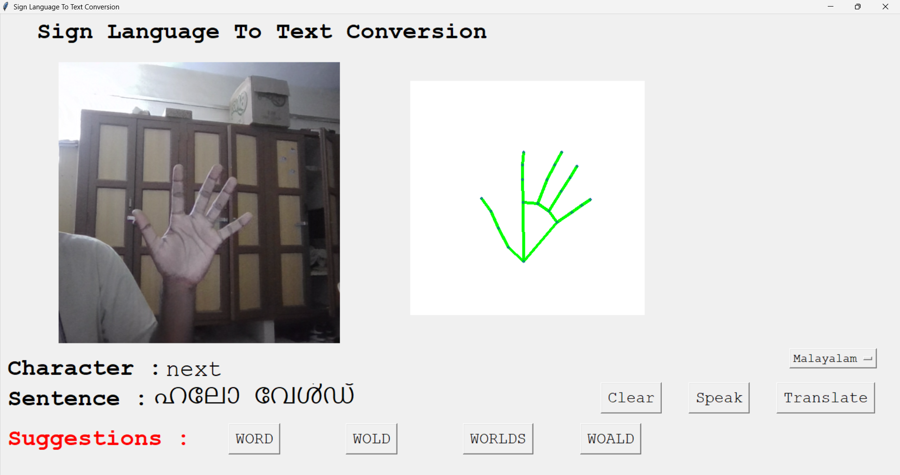
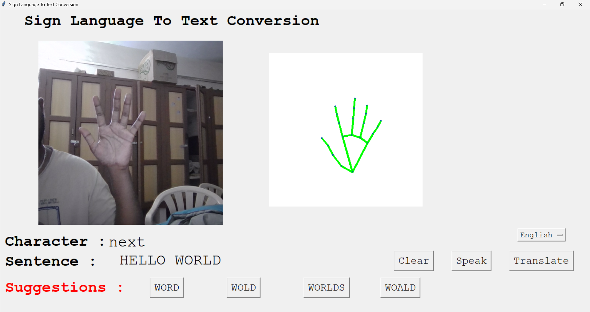
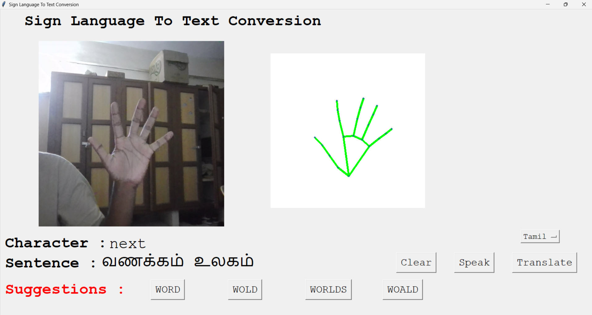
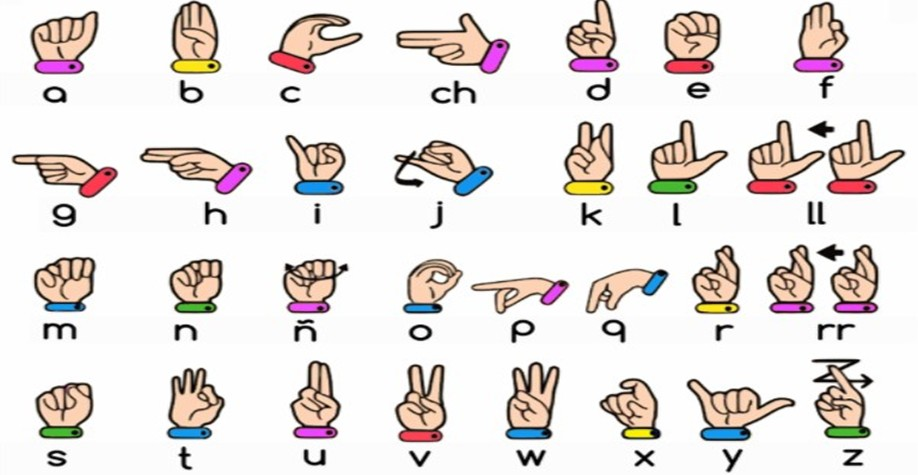

# 🤟 Sign Language Recognition, Translation and Text-to-Speech System

This is a real-time **Sign Language Recognition System** that can:
- Detect hands using webcam
- Recognize American Sign Language (A–Z alphabets)
- Form full sentences from recognized signs
- Translate sentences into multiple languages (like Tamil, Hindi, French, etc.)
- Speak out the translated sentences using Text-to-Speech (TTS)

Built with Deep Learning (TensorFlow) + Hand Tracking (MediaPipe & OpenCV), this project is fast, intelligent, and interactive!

---

## 🚀 Features

- ✋ **Real-Time Hand Detection** using OpenCV and MediaPipe
- 🔠 **Alphabet Recognition** (A-Z) using a trained CNN model
- ✍️ **Automatic Sentence Formation** from recognized alphabets
- 🌐 **Language Translation** into 15+ languages
- 🔊 **Speech Output (TTS)** to read sentences aloud
- ✨ **Word Suggestions** with Spell Checking using Enchant
- 🖥️ **User-friendly GUI** with Tkinter
- ⚡ **GPU Acceleration** (TensorFlow-GPU Supported)

---

## 📸 Demo Images

| Hand Detection | Alphabet Recognition | Sentence Building |
| :------------: | :-------------------: | :----------------: |
|  |  |  |

**Preview of Sign Language Alphabets:**  


---


## 🛠️ Installation Guide

Follow these steps to run the project:

1. **Clone the Repository**
   ```bash
   git clone https://github.com/Sarvesh-5/Sign-Language-Recognition.git
   cd Sign-Language-Recognition
   ```

2. **Create and Activate a Conda Environment**
   ```bash
   conda create -n project_1 tensorflow-gpu
   conda activate project_1
   ```

3. **Install All Requirements**
   ```bash
   pip install -r requirements.txt
   ```

4. **(Optional) Install Jupyter Kernel**
   ```bash
   pip install ipykernel
   python -m ipykernel install --user --name=mykernel
   ```

5. **Run the Application**
   ```bash
   python your_main_script.py
   ```
   (Replace `your_main_script.py` with your actual Python file name.)

---

## 📦 Requirements

Main libraries:

- TensorFlow 2.10.0 (GPU version)
- OpenCV
- MediaPipe
- CVZone
- pyttsx3
- Pillow
- googletrans==4.0.0rc1
- mtranslate
- pyenchant
- pygame

(Complete list available in `requirements.txt`.)

---

## 🎯 How It Works

- The webcam captures your hand gestures.
- The deep learning model predicts the shown alphabet.
- Alphabets are intelligently combined into words and sentences.
- Translations are available at the click of a button.
- Sentences can be spoken aloud using the Speak button.

---

## 🎨 Future Enhancements

- Recognize dynamic signs and gestures (not just static alphabets).
- Expand to full words recognition (like "HELLO", "THANK YOU", etc.)
- Deploy as a Web App for easier access.
- Integrate advanced spell correction for complex sentences.

---

## 🤝 Contributions

Contributions are welcome! Feel free to submit pull requests or raise issues for discussion.

---

## 📜 License

This project is available for educational purposes.  
For any commercial usage, please contact the owner.

---
